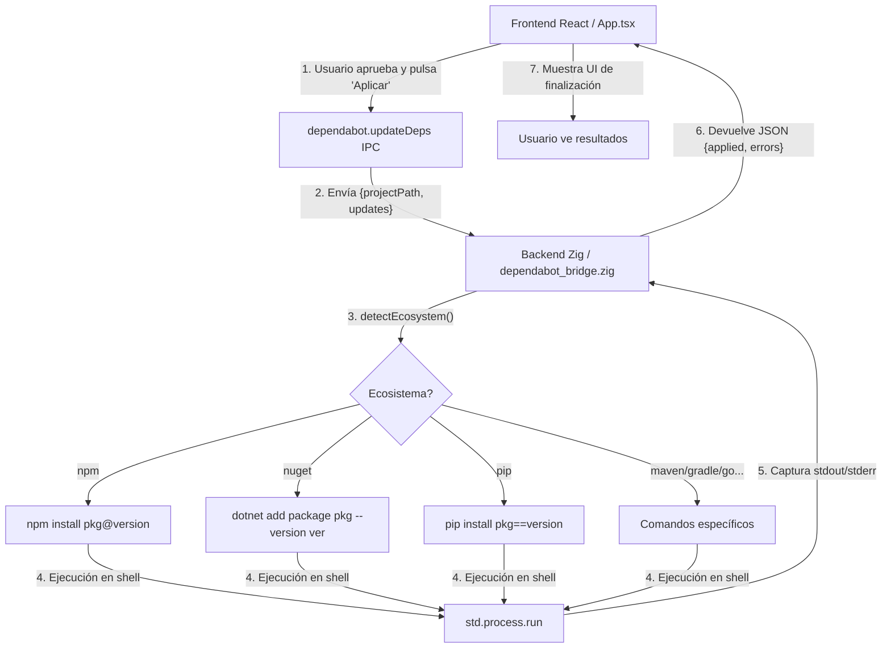

# Flujo de Aprobación de Actualizaciones de Dependencias (Dependabot)

> **Fecha de implementación**: 2 de junio de 2026
> **Archivos principales**: `frontend/src/App.tsx`, `src/dependabot_bridge.zig`, `src/main.zig`, `frontend/src/index.css`

## Resumen

Esta funcionalidad complementa el flujo de CodeQL permitiendo al usuario revisar, aprobar y aplicar automáticamente las actualizaciones de dependencias sugeridas por Dependabot. 

A diferencia del flujo de corrección de código (que requiere un LLM como Copilot para generar el parche), el flujo de Dependabot es determinista: se conoce el paquete exacto, la versión actual y la versión objetivo. Por lo tanto, **no se utiliza IA en este proceso**. Las actualizaciones se delegan directamente a los gestores de paquetes nativos del ecosistema (npm, dotnet, pip, etc.) a través del backend en Zig.

---

## Arquitectura

---

## Flujo de Trabajo en el Frontend

### 1. Preparación de la Interfaz (`App.tsx`)

Cuando el usuario hace clic en "Actualizar dependencias" en la pestaña de Dependabot, se invoca `handleResolveDependencies`. 

- Se reutiliza la interfaz modal existente, diferenciando su comportamiento mediante el estado `resolveTarget = 'dependabot'`.
- Los `dependabotAlerts` se mapean al formato estandarizado `ProposedFix`.
- Se evalúa la **dificultad/riesgo** basándose en el tipo de salto de versión (Major, Minor, Patch):
  - **Major**: Alto riesgo (breaking changes posibles). Se marca como `requiresHumanRevision` y se deselecciona por defecto.
  - **Minor**: Riesgo medio. Pre-seleccionado.
  - **Patch**: Riesgo bajo. Pre-seleccionado.

### 2. Estilos Visuales Adaptados (`index.css`)

El modal se adapta condicionalmente:
- Se reemplaza la ruta del archivo por el **nombre del paquete**.
- Se muestra un nuevo badge visual `.fix-version-transition` que indica el salto (ej. `1.2.3 → 2.0.0`).
- Las actualizaciones *Major*, aunque requieren revisión humana, permiten ser seleccionadas si el usuario asume el riesgo (a diferencia de CodeQL, donde Copilot bloquea explícitamente los cambios muy complejos). Para esto se ajustó la opacidad en CSS y se eliminó la restricción de click.

### 3. Ejecución (`handleApplyDependencyUpdates`)

Una vez seleccionados los paquetes, el frontend llama al IPC `dependabot.updateDeps` enviando la ruta del proyecto y un array de objetos `{ package, version }`.

---

## Ejecución en el Backend (`dependabot_bridge.zig`)

El comando registrado en `main.zig` delega la ejecución a `updateDeps` en el puente de Dependabot.

### 1. Detección Automática de Ecosistema (`detectEcosystem`)

Antes de aplicar los cambios, el backend Zig rastrea la raíz del proyecto para identificar la tecnología en uso buscando archivos manifiesto clave:
- `package.json` -> npm (o `frontend/package.json` para npm_frontend)
- `*.csproj` -> nuget (dotnet)
- `requirements.txt` -> pip (python)
- `pom.xml` -> maven (java)
- `build.gradle` -> gradle (java/android)
- `go.mod` -> gomod (go)
- `Cargo.toml` -> cargo (rust)

### 2. Ensamblado del Comando (`buildAndRunUpdateCommand`)

Dependiendo del ecosistema detectado, Zig construye dinámicamente un comando nativo que es 100% equivalente a lo que escribiría un desarrollador en la terminal:

| Ecosistema | Comando generado |
| :--- | :--- |
| **npm** | `cd "..." && npm install package@version --save` |
| **nuget** | `cd "..." && dotnet add "proyecto.csproj" package nombre --version X.X.X` |
| **pip** | `cd "..." && pip install package==version` |
| **gradle** | `cd "..." && sed -i "s/pkg:[^'\"]*/pkg:version/g" build.gradle` |
| **go** | `cd "..." && go get package@vX.X.X` |

*(La lista completa incluye soporte para Maven, Bundler, Cargo y Composer).*

### 3. Ejecución Aislada y Respuesta

- Zig envuelve el comando en `bash -lc "comando"` para garantizar que las variables de entorno (como el PATH de Node o Dotnet) estén cargadas correctamente.
- Se utiliza `std.process.run` para ejecutar el comando de forma síncrona dentro de un subhilo.
- Los éxitos y fracasos se recopilan iterativamente y se envuelven de forma segura escapando caracteres conflictivos (`escapeJsonString`).
- El JSON final `{ applied: [...], errors: [...] }` se devuelve al frontend mediante `responder.success()`.

---

## Consideraciones de Seguridad

- **Pre-aprobación Selectiva**: Las actualizaciones que modifican la versión mayor se desmarcan automáticamente y muestran una alerta naranja, forzando al usuario a leer los *release notes* o asumir el riesgo antes de actualizar.
- **Sandboxing de Rutas**: Los comandos `cd` se encierran estrictamente entre comillas y apuntan a la ruta base original (analizada en el escaneo).
- **Ejecución Local Nativa**: No se hacen escrituras directas sobre el disco mediante el lenguaje de programación; se delega toda la mutación del árbol de dependencias a las herramientas oficiales del sistema (`npm`, `dotnet`, etc.), garantizando que se respeten los *lockfiles* (`package-lock.json`, etc.) y las resoluciones del ecosistema.
