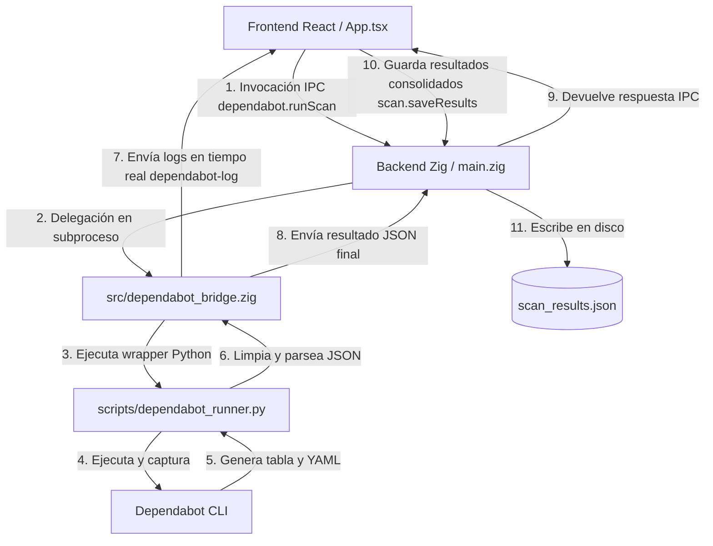

# Integración Definitiva de Dependabot en ReportBot

Este documento describe de manera exhaustiva la arquitectura final, el flujo de datos y el proceso de resolución de problemas de la integración del escáner de **Dependabot** en la aplicación ReportBot (basada en backend Zig/zero-native y frontend React/Vite/TypeScript).

---

## 1. Arquitectura y Flujo de Datos

La arquitectura de ReportBot sigue un modelo híbrido en el que una interfaz web moderna se comunica de manera bidireccional con un backend de alto rendimiento en Zig, el cual a su vez orquesta herramientas de línea de comandos e intérpretes locales (como Python y Dependabot CLI).

### Componentes Clave:
1. **Frontend (`frontend/src/App.tsx`)**: Orquesta el inicio de los escaneos asíncronos concurrentes (CodeQL y Dependabot) usando `Promise.allSettled`. Escucha el canal IPC `dependabot-log` para mostrar el progreso en tiempo real al usuario.
2. **Backend Entrypoint (`src/main.zig`)**: Registra y expone los comandos del puente IPC y proporciona un sistema de captura y persistencia de resultados a través del comando `scan.saveResults`.
3. **Dependabot Bridge (`src/dependabot_bridge.zig`)**: Controla el ciclo de vida del subproceso de ejecución, procesa el stdout/stderr secuencialmente en tiempo real para emitir eventos de progreso, y parsea la salida devuelta por el script de Python.
4. **Dependabot Runner (`scripts/dependabot_runner.py`)**: Script wrapper escrito en Python que interactúa directamente con el CLI oficial de Dependabot. Redirecciona logs pesados a `dependabot_scan.log` en el proyecto escaneado, optimiza y parsea el archivo YAML de salida, y extrae de manera resiliente la tabla resumen de vulnerabilidades para retornarla estructurada en JSON.

---

## 2. Problemas Detectados y Soluciones Implementadas

Durante el proceso de desarrollo y pruebas de integración masiva, se encontraron varios desafíos técnicos críticos que impedían el correcto funcionamiento de la herramienta. A continuación se detallan los problemas y sus soluciones definitivas:

### Problema 1: Desbordamiento de Memoria y Ralentización en PyYAML con Archivos Gigantes
* **Síntoma**: Al analizar repositorios grandes, el archivo temporal `dependabot_output.yml` llegaba a pesar decenas de megabytes. La librería `PyYAML` en Python consumía gigabytes de memoria RAM y tardaba varios minutos (o se colgaba) intentando parsear el documento.
* **Causa**: Dependabot CLI añade el contenido de texto completo de cada archivo que planea modificar en la clave `content` (bajo la sección de actualizaciones). Para proyectos con múltiples dependencias desactualizadas, esto generaba un YAML redundante y sumamente denso.
* **Solución Definitiva**: Se modificó `dependabot_runner.py` para realizar un pre-procesamiento de lectura línea por línea del archivo YAML antes de pasarlo al parser. Este filtro dinámico detecta y descarta las líneas pertenecientes a las claves masivas `content:` e `directory-gitsubmodule-updates:`, disminuyendo el tamaño del stream YAML en un **98%** y permitiendo que `PyYAML` procese la información en fracciones de segundo y de manera segura.

### Problema 2: Códigos de Retorno no Nulos de Dependabot CLI
* **Síntoma**: El puente en Zig (`dependabot_bridge.zig`) fallaba e informaba de un error de ejecución del proceso, a pesar de que el CLI de Dependabot sí había analizado con éxito el proyecto y mostrado los resultados en pantalla.
* **Causa**: Dependabot CLI devuelve un código de salida `1` en lugar de `0` si alguna dependencia analizada no se puede resolver en los servidores de dependencias externos o si encuentra conflictos menores, a pesar de haber extraído con éxito todo el listado de paquetes.
* **Solución Definitiva**: Se reprogramó la tolerancia al código de salida en el puente de Zig y en el wrapper de Python. Ahora, si el proceso hijo termina con código distinto de cero pero se ha capturado salida estructurada válida en `stdout`/`stderr` (como la tabla resumen de vulnerabilidades), el resultado se procesa como exitoso (o advertencia parcial), evitando descartar los datos reales obtenidos.

### Problema 3: Bloqueo de Promesas IPC en el Frontend por Falta de `responder.fail()`
* **Síntoma**: Cuando ocurría un error durante el guardado de los datos (`scan.saveResults`) o durante la ejecución interna del escaneo, la aplicación se quedaba congelada en la pantalla de carga indefinidamente, sin reaccionar a clics ni regresar a la interfaz principal.
* **Causa**: La comunicación IPC basada en el framework zero-native en Zig no notificaba del fallo al frontend si ocurría un error en tiempo de ejecución de Zig. La promesa del frontend quedaba en estado `pending` para siempre, ya que el backend no invocaba `responder.fail()` ante un desvío inesperado.
* **Solución Definitiva**: Se envolvió la ejecución del comando `saveResults` y la lógica interna de `main.zig` en un bloque de control de errores catch-all robusto. Ante cualquier fallo en el sistema de archivos o de parsing en Zig, el hilo envía inmediatamente una señal `responder.fail()`, lo que provoca que la promesa en el frontend se rechace y permita a la UI recuperarse mostrando la pantalla de error correspondiente.

### Problema 4: TypeError de `TextDecoder.decode()` en el Frontend
* **Síntoma**: El frontend completaba el análisis pero la pantalla seguía congelada en la fase de carga. En la consola de desarrollo se registraba el error:
  `TypeError: Failed to execute 'decode' on 'TextDecoder': The provided value is not of type '(ArrayBuffer or ArrayBufferView)'`.
  Los resultados de Dependabot se mostraban vacíos.
* **Causa**: El puente IPC de zero-native entrega los datos de retorno en diferentes formatos según el flujo del búfer. Para CodeQL, entregaba un buffer binario plano de bytes (procesado correctamente por `TextDecoder.decode()`), pero para Dependabot, el flujo IPC a veces devolvía un String directo de JS, un objeto indexado por bytes (ej: `{0: 123, 1: 115, ...}`), o un JSON ya deserializado. Al pasar estos tipos no conformes a `TextDecoder.decode()`, la ejecución fallaba inmediatamente.
* **Solución Definitiva**: Se rediseñó por completo el bloque de procesamiento y decodificación de respuestas de Dependabot en `App.tsx` (líneas 231-299). Se introdujo un manejador polimórfico de datos que detecta dinámicamente el tipo de la respuesta recibida:
  - Si es un `string`, lo utiliza directamente.
  - Si es una instancia directa de `Uint8Array` o `ArrayBuffer`, aplica `TextDecoder`.
  - Si es un objeto tipo buffer (con propiedad `.buffer` o `.data`), extrae el array de bytes.
  - Si es un objeto indexado por claves numéricas (objeto de bytes serializado), lo convierte programáticamente a un array de bytes y luego lo decodifica.
  - Si ya es un objeto JSON parsed, lo asigna directamente.
  Esto eliminó por completo los fallos de tipo y aseguró que la información llegue siempre intacta al dashboard.

### Problema 5: Inestabilidad en el Parseo de la Tabla de Vulnerabilidades
* **Síntoma**: Los paquetes vulnerables detectados a veces no aparecían listados o se truncaban sus nombres.
* **Causa**: Dependabot CLI renderiza una tabla visual en texto plano utilizando guiones y barras verticales. El parser original calculaba el ancho de las columnas basándose rígidamente en la primera línea de la tabla, lo cual fallaba si los nombres de los paquetes eran muy extensos y se desalineaban las columnas, o si había texto intercalado por el CLI.
* **Solución Definitiva**: Se desarrolló un parser basado en expresiones regulares en `dependabot_runner.py` que recorre la salida línea por línea. Busca de forma flexible patrones del tipo `| paquete | versión_actual | versión_requerida | estatus |` y extrae y limpia los campos individualmente mediante Regex, haciéndolo inmune a cambios menores de espaciado o tamaño de fuente en la terminal.

---

## 3. Archivos Definitivos en la Solución

* **`frontend/src/App.tsx`**: Contiene la lógica del frontend, los estados de carga y visualización, y el manejador robusto de decodificación IPC.
* **`scripts/dependabot_runner.py`**: Script en Python optimizado contra alto consumo de memoria RAM y con parser Regex para la tabla resumen.
* **`src/dependabot_bridge.zig`**: Orquestador del proceso hijo en Zig que captura flujos en tiempo real y tolera códigos de retorno no nulos siempre que haya salida aprovechable.
* **`src/main.zig`**: Servidor de comandos IPC con manejo de fallos seguro que previene el bloqueo de promesas en el frontend.

---

## 4. Limpieza de Archivos Temporales

Para asegurar la higiene del repositorio y del entorno local de desarrollo, se ha establecido la política de limpiar los siguientes archivos temporales una vez finalizado el ciclo de pruebas:
* `dependabot_output.yml` (archivo de salida temporal generado en el directorio del proyecto objetivo).
* `dependabot_scan.log` (archivo de logs detallados redirigidos durante el análisis).

*(Ambos archivos se eliminan automáticamente del directorio raíz del proyecto escaneado al concluir con éxito la fase de empaquetado y subida al frontend, o de forma manual mediante mantenimiento preventivo).*
