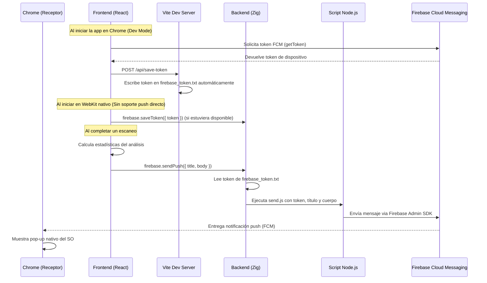

# Documentación: Firebase Cloud Messaging en ReportBot

## 1. Introducción

ReportBot integra **Firebase Cloud Messaging (FCM)** para enviar notificaciones push nativas al escritorio del usuario cuando un análisis de seguridad (CodeQL, Dependabot) finaliza. Esto permite al usuario lanzar un escaneo, dedicarse a otra tarea, y recibir un aviso automático con el resumen de los resultados.

---

## 2. Arquitectura General

La implementación sigue una arquitectura de tres capas que conecta el frontend de React con los servidores de Google a través del backend de Zig:



### Resumen del flujo

| Paso | Componente | Acción |
|------|-----------|--------|
| 1 | Frontend (React) | Solicita permiso de notificaciones al usuario y obtiene un token FCM |
| 2 | Frontend → Backend | Envía el token al backend vía IPC (`firebase.saveToken`) |
| 3 | Backend (Zig) | Persiste el token en `firebase_token.txt` en la raíz del proyecto |
| 4 | Frontend (React) | Cuando el escaneo termina, calcula las estadísticas y llama a `firebase.sendPush` |
| 5 | Backend (Zig) | Lee el token del archivo y ejecuta el script Node.js |
| 6 | Script Node.js | Usa Firebase Admin SDK para enviar la notificación a los servidores de Google |
| 7 | Google FCM | Entrega la notificación al navegador/dispositivo del usuario |

---

## 3. Pasos de Configuración en Firebase Console

### 3.1 Crear el proyecto en Firebase

1. Ir a [Firebase Console](https://console.firebase.google.com/)
2. Hacer clic en **"Añadir proyecto"**
3. Asignar el nombre del proyecto (en nuestro caso: `reportbot-b0efe`)
4. Opcionalmente habilitar Google Analytics
5. Hacer clic en **"Crear proyecto"**

### 3.2 Registrar la aplicación web

1. En la página principal del proyecto, hacer clic en el icono de **Web** (`</>`)
2. Asignar un apodo a la app (ej: `ReportBot Web`)
3. Firebase generará un bloque de configuración con las claves públicas:
   ```javascript
   const firebaseConfig = {
     apiKey: "...",
     authDomain: "...",
     projectId: "...",
     storageBucket: "...",
     messagingSenderId: "...",
     appId: "...",
     measurementId: "..."
   };
   ```
4. Copiar estas claves y pegarlas en los archivos del frontend (ver sección 5.1 y 5.2)

### 3.3 Generar la clave VAPID (Web Push Certificates)

1. En Firebase Console, ir a **Configuración del proyecto** (⚙️) → **Cloud Messaging**
2. En la sección **"Web Push certificates"**, hacer clic en **"Generate key pair"**
3. Copiar la clave pública generada (una cadena Base64 larga)
4. Esta clave se usa como `vapidKey` en el frontend (ver sección 5.1)

### 3.4 Generar la clave privada del servidor (Service Account)

1. En Firebase Console, ir a **Configuración del proyecto** (⚙️) → **Cuentas de servicio**
2. Hacer clic en **"Generar nueva clave privada"**
3. Se descargará un archivo JSON (ej: `reportbot-b0efe-firebase-adminsdk-xxxxx.json`)
4. Renombrar este archivo a `service-account.json`
5. Colocarlo en la carpeta `scripts/firebase_push/`

> [!CAUTION]
> El archivo `service-account.json` contiene credenciales de administrador. **Nunca debe subirse a Git.** Está protegido en el `.gitignore`.

### 3.5 Instalar dependencias de Node.js

```bash
cd scripts/firebase_push/
npm install firebase-admin
```

### 3.6 Instalar dependencias del Frontend

```bash
cd frontend/
npm install firebase
```

---

## 4. Estructura de Archivos

```
my_app/
├── firebase_token.txt                          # Token FCM del dispositivo (generado automáticamente, ignorado por Git)
├── .gitignore                                  # Protege firebase_token.txt y service-account.json
│
├── frontend/
│   ├── public/
│   │   └── firebase-messaging-sw.js            # Service Worker para notificaciones en background
│   └── src/
│       ├── firebase.ts                         # Módulo de inicialización de Firebase en el cliente
│       └── App.tsx                             # Componente principal (inicializa FCM y dispara notificaciones)
│
├── scripts/
│   └── firebase_push/
│       ├── send.js                             # Script Node.js que envía la notificación vía Firebase Admin SDK
│       ├── service-account.json                # Clave privada del servidor (NO subir a Git)
│       ├── package.json                        # Dependencias (firebase-admin)
│       └── node_modules/                       # Módulos instalados
│
└── src/
    ├── firebase.zig                            # Puente IPC: saveToken y sendPush
    └── main.zig                                # Registro de los handlers IPC de Firebase
```

---

## 5. Descripción de los Componentes

### 5.1 Frontend: `frontend/src/firebase.ts`

Este módulo se encarga de la comunicación directa con los servidores de Firebase desde el navegador. Expone dos funciones:

- **`initializeFirebasePush()`**: Solicita permiso de notificaciones al usuario y, si se concede, obtiene un token FCM único para este dispositivo/navegador usando la clave VAPID. Devuelve el token o `null`.

- **`listenToMessages()`**: Registra un listener para mensajes que llegan mientras la pestaña está activa (foreground). Cuando llega un mensaje, crea una notificación nativa del sistema operativo usando la Web Notifications API.

### 5.2 Frontend: `frontend/public/firebase-messaging-sw.js`

Es un **Service Worker** que se ejecuta en segundo plano, incluso cuando la pestaña del navegador está cerrada o minimizada. Es responsable de:

- Recibir mensajes push de Firebase cuando la app **no está en primer plano**
- Mostrar la notificación nativa del sistema operativo con `self.registration.showNotification()`

> [!NOTE]
> Este archivo debe estar en la carpeta `public/` para que sea servido desde la raíz del dominio, ya que los Service Workers solo pueden controlar páginas dentro de su alcance (scope).

### 5.3 Frontend: `frontend/src/App.tsx`

El componente principal de React integra Firebase en dos puntos:

**Inicialización** (al montar la app):
```tsx
useEffect(() => {
  initializeFirebasePush().then(token => {
    if (token) {
      if ((window as any).zero) {
        (window as any).zero.invoke("firebase.saveToken", { token }).catch(console.error);
      } else {
        // Si estamos en un navegador normal (como Chrome), enviamos el token al servidor de desarrollo de Vite
        fetch("/api/save-token", {
          method: "POST",
          headers: {
            "Content-Type": "application/json",
          },
          body: JSON.stringify({ token }),
        })
          .then(res => res.json())
          .then(data => {
            console.log("[FCM] Token guardado automáticamente en el servidor de desarrollo:", data);
          })
          .catch(err => {
            console.error("[FCM] Error enviando token al servidor de desarrollo:", err);
          });
      }
    }
  });
  listenToMessages();
}, []);
```
Al montar la app, solicita el token FCM. Si se ejecuta dentro de WebKit nativo (con la interfaz de `zero-native`), intenta enviarlo mediante IPC. Si se ejecuta desde un navegador normal como Chrome (entorno de desarrollo), realiza un `POST` al servidor de desarrollo de Vite para guardarlo automáticamente.

**Disparo de notificación dinámica** (al completar el escaneo):
```tsx
// --- FIREBASE DYNAMIC PUSH ---
const totalIssues = stats.critical + stats.high + stats.medium + stats.low;
let bodyMsg = "¡El análisis ha finalizado perfectamente! 0 vulnerabilidades.";
if (totalIssues > 0) {
  bodyMsg = `Análisis terminado con ${totalIssues} vulnerabilidades encontradas (Críticas: ${stats.critical}, Altas: ${stats.high}).`;
}
await (window as any).zero.invoke("firebase.sendPush", {
  title: "ReportBot - Resultados listos",
  body: bodyMsg
});
```
Cuando el escaneo termina y los resultados están listos, calcula las estadísticas y envía un mensaje personalizado al backend indicando el resultado del análisis.

---

### 5.4 Backend: `src/firebase.zig`

El puente de Zig que conecta el frontend con el script Node.js. Contiene la estructura `FirebaseBridge` con dos endpoints IPC:

#### `firebase.saveToken`
- **Recibe**: `{ "token": "<FCM_TOKEN>" }` desde el frontend
- **Acción**: Escribe el token en `firebase_token.txt` en la raíz del proyecto
- **Resolución de ruta**: Calcula la raíz del proyecto relativa al ejecutable (que está en `zig-out/bin/`)

#### `firebase.sendPush`
- **Recibe**: `{ "title": "...", "body": "..." }` desde el frontend
- **Acción**:
  1. Lee el token desde `firebase_token.txt` usando `resolveCandidatePath()`
  2. Localiza el script `scripts/firebase_push/send.js` también de forma relativa
  3. Ejecuta: `node send.js <token> <título> <cuerpo>`
  4. Devuelve éxito o error al frontend

#### `resolveCandidatePath()`
Función auxiliar que busca un archivo relativo al directorio del ejecutable, probando múltiples niveles de profundidad (`../../`, `../../../`, etc.) para encontrarlo sin depender de rutas absolutas.

### 5.5 Backend: `src/main.zig`

Registra los dos handlers IPC de Firebase en el dispatcher del bridge principal de la aplicación:

```zig
handlers[cq_disp.async_registry.handlers.len + 8] = .{
    .name = "firebase.saveToken",
    .context = &app_instance.firebase_bridge,
    .invoke_fn = firebase_bridge.FirebaseBridge.saveToken,
};
handlers[cq_disp.async_registry.handlers.len + 9] = .{
    .name = "firebase.sendPush",
    .context = &app_instance.firebase_bridge,
    .invoke_fn = firebase_bridge.FirebaseBridge.sendPush,
};
```

### 5.6 Script: `scripts/firebase_push/send.js`

Script de Node.js que actúa como el último eslabón de la cadena. Usa el SDK de administrador de Firebase (`firebase-admin`) para autenticarse con las credenciales del servidor y enviar el mensaje push a Google:

- **Argumento 1** (`process.argv[2]`): Token FCM del dispositivo destino
- **Argumento 2** (`process.argv[3]`): Título de la notificación (default: `"ReportBot"`)
- **Argumento 3** (`process.argv[4]`): Cuerpo del mensaje (default: `"¡El proceso ha finalizado!"`)

El token se limpia con `.trim()` para evitar errores causados por saltos de línea al leerlo desde el archivo.

### 5.7 Middleware de Vite: `frontend/vite.config.js`

El servidor de desarrollo de Vite actúa como puente automático cuando ejecutas la app en un navegador externo durante el desarrollo:

- Añade un middleware en `configureServer` que escucha peticiones `POST` en `/api/save-token`.
- Cuando Chrome envía un token FCM nuevo al iniciar la app, el middleware lo escribe directamente en `firebase_token.txt` en la raíz del proyecto.
- Esto elimina por completo la necesidad de copiar y pegar manualmente el token desde la consola del navegador.

---

## 6. Seguridad

### Archivos protegidos en `.gitignore`

| Archivo | Riesgo si se expone | Estado |
|---------|---------------------|--------|
| `firebase_token.txt` | Bajo — identifica un dispositivo, se puede revocar | ✅ Ignorado |
| `service-account.json` | **Alto** — da acceso de administrador al proyecto Firebase | ✅ Ignorado |

### Claves públicas en el código fuente

Las claves presentes en `firebase.ts` y `firebase-messaging-sw.js` (`apiKey`, `appId`, `vapidKey`) son **claves públicas por diseño**. Firebase las diseñó para ser incluidas en código del lado del cliente. No otorgan acceso administrativo al proyecto; solo identifican la aplicación ante los servidores de Google. La seguridad real se gestiona mediante:

- Las **Reglas de Seguridad** configuradas en la consola de Firebase
- El archivo `service-account.json` que nunca abandona el servidor

> [!IMPORTANT]
> Si deseas que los escáneres de seguridad no generen falsos positivos, puedes mover estas claves a variables de entorno usando un archivo `.env` con prefijo `VITE_` (ej: `VITE_FIREBASE_API_KEY`). Vite las inyectará en tiempo de compilación.

---

## 7. Pruebas Manuales

### Probar el envío manual de una notificación

```bash
node scripts/firebase_push/send.js "<TOKEN_FCM>" "Título de prueba" "Cuerpo del mensaje"
```

Si el token es válido, la salida será:
```
Notificación enviada exitosamente: projects/reportbot-b0efe/messages/<ID>
```

### Probar el flujo completo

1. Ejecutar `zig build run` para arrancar la aplicación nativa
2. Iniciar un escaneo desde la interfaz
3. Al completarse, el backend enviará automáticamente la notificación con las estadísticas
4. La notificación aparecerá como un pop-up nativo del sistema operativo

> [!TIP]
> Si la pestaña del navegador está activa y en primer plano, Firebase redirige el mensaje al listener de JavaScript en lugar de mostrar el pop-up nativo. Para ver el pop-up, minimiza la ventana o cambia a otra aplicación antes de que termine el escaneo.

---

## 8. Solución de Problemas Comunes

| Error | Causa | Solución |
|-------|-------|----------|
| `firebase_token.txt not found` | El archivo de token no existe en la raíz del proyecto | Abrir la app en Chrome (`localhost:5173`) para que el middleware de Vite capture y cree el archivo de token de manera totalmente automática. |
| `NotRegistered` | El token FCM ha caducado o se ha revocado | Abrir e interactuar con la app en Chrome para renovar y guardar el token automáticamente. |
| `service-account.json not found` | Falta la clave privada del servidor | Descargarla desde Firebase Console → Configuración → Cuentas de servicio |
| No aparece el pop-up | La pestaña está activa y en primer plano | Minimizar la ventana antes de que finalice el escaneo |
| `Permiso de notificaciones denegado` | El usuario rechazó el permiso en el navegador | Ir a Configuración del navegador → Permisos → Notificaciones → Permitir para `localhost` |
